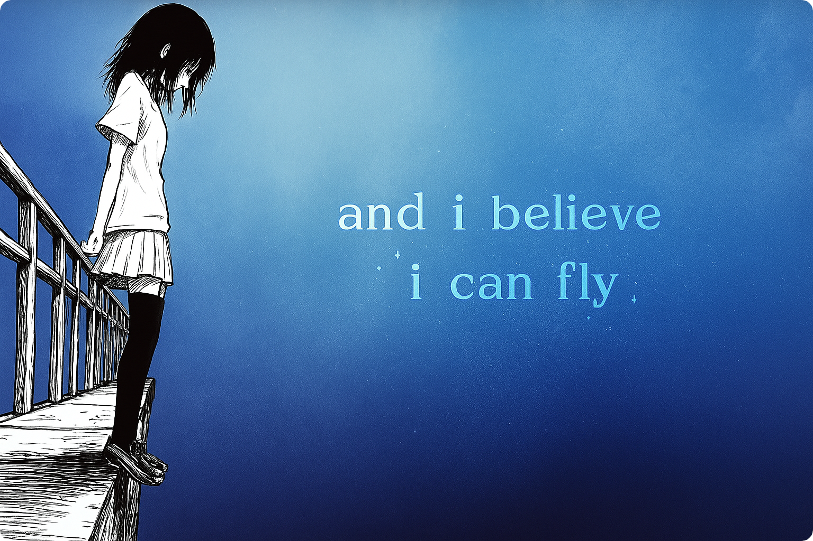
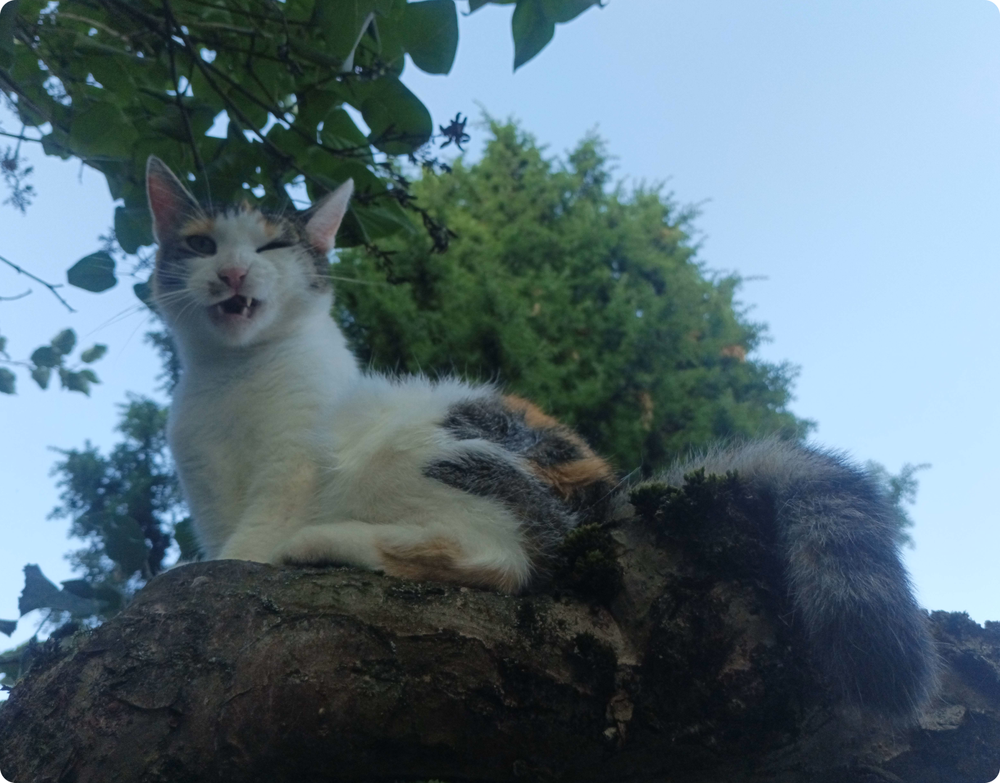

### Welcome on my profile, I'm Sefinek

### 🌍 〢 Projects
🏠 » [sefinek.net](https://sefinek.net) • My official website  
✨ » [api.sefinek.net](https://api.sefinek.net) • Free API for developers  
📃 » [blocklist.sefinek.net](https://blocklist.sefinek.net) • The top blocklist collection  
🎮 » [sniffcat.com](https://sniffcat.com) • A database of malicious IP addresses

### 📊 〢 Profile views

     

### 😺 〢 I like...
  

### 😾 〢 I don't like...

    

