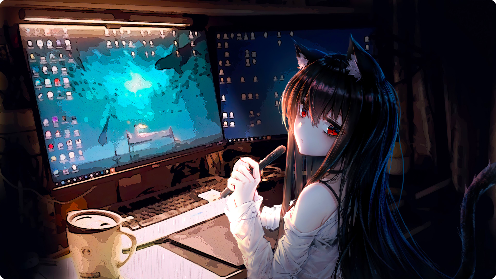
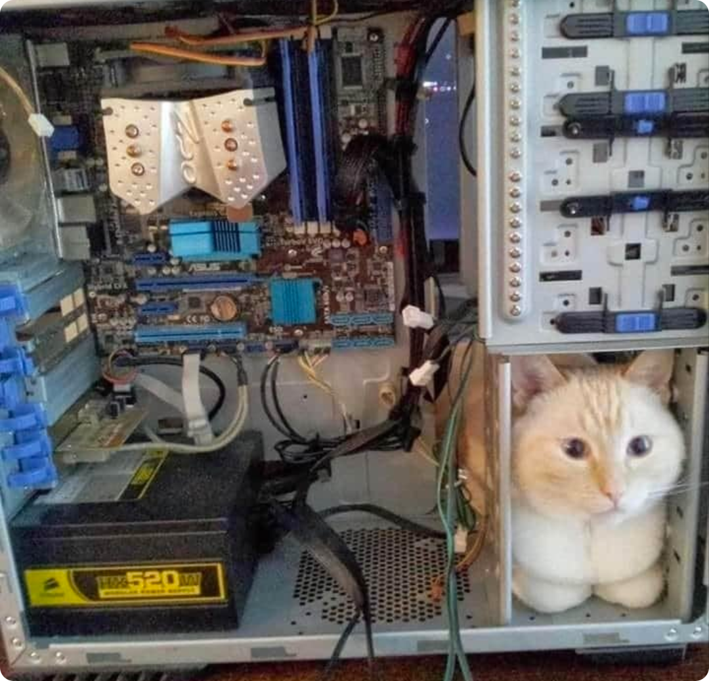
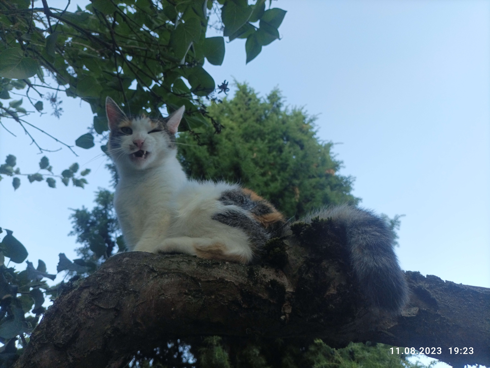

[//]: # (> [!IMPORTANT])
[//]: # (> I recently updated my GitHub username from `sefinek24` to `sefinek`. Please make sure to update any associated links &#40;:   )
[//]: # (> https://github.com/sefinek24 -> https://github.com/sefinek  )
[//]: # (> https://raw.githubusercontent.com/sefinek24 -> https://raw.githubusercontent.com/sefinek)
[//]: # ()

### Welcome on my profile, I'm Sefinek!

### 🌍 〢 Projects
🏠 » [sefinek.net](https://sefinek.net) • My official website  
✨ » [api.sefinek.net](https://api.sefinek.net) • Free API; filters, random animals, etc.  
🎮 » [stella.sefinek.net](https://sefinek.net/genshin-stella-mod) • The best & safe mod for Genshin Impact  
😻 » [nekosia.cat](https://nekosia.cat) • API with random anime images & booru

 
 
 

<h2>😺 〢 I like...</h2>
 

<h2>😾 〢 I don't like...</h2>

## 😻 〢 Meow?

    

    

