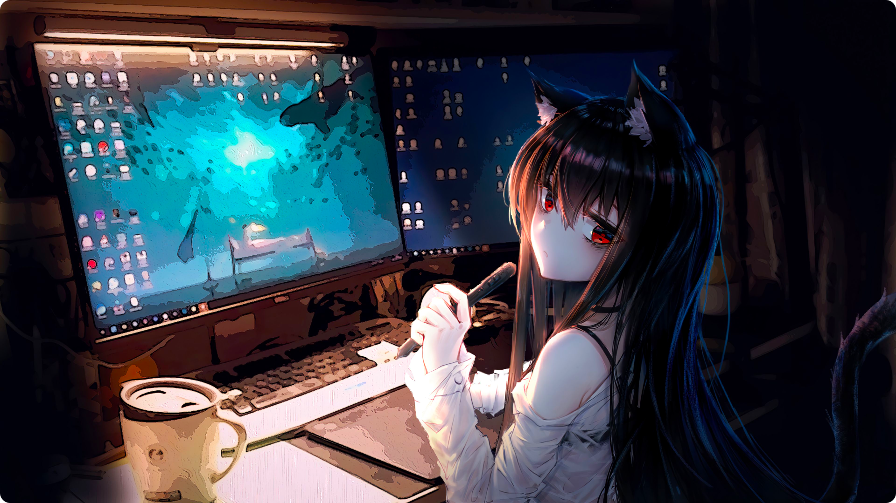
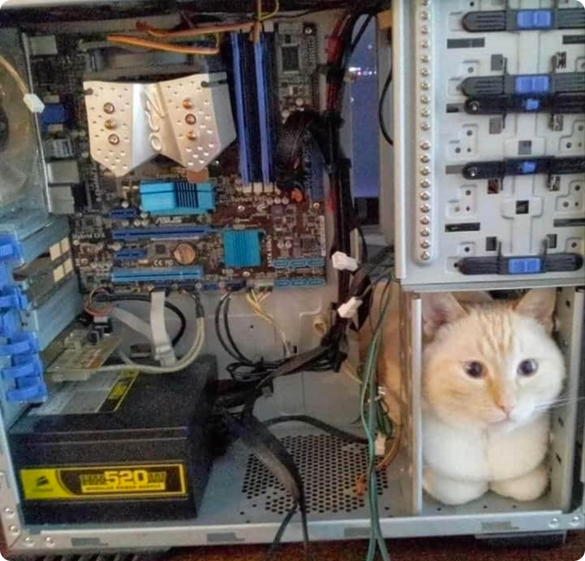
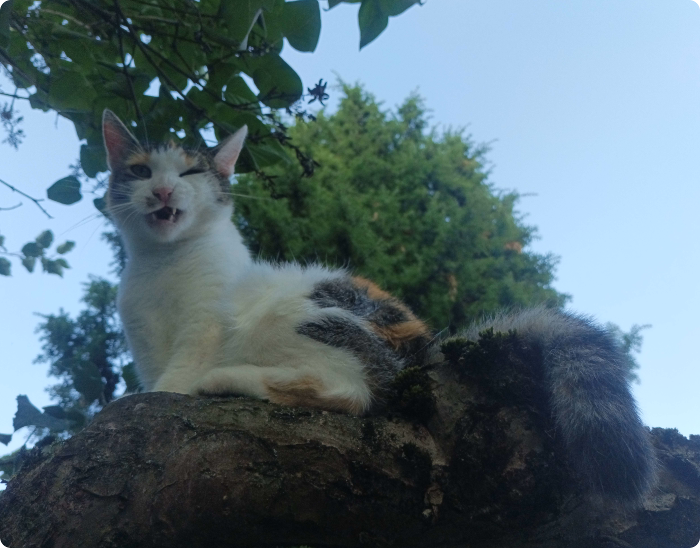
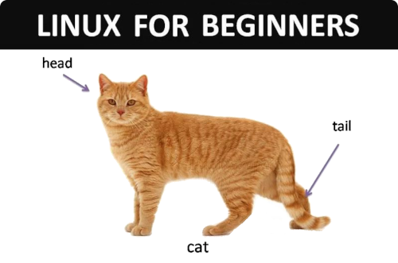

    <h1>Hello, I'm Sefinek 👋</h1>
    <i>Independent thinker, guided by logic and curiosity.</i>

 
I specialize in system and server administration.
I'm also interested in programming and web development, with a strong focus on practical applications and automation. My work mainly involves open-source solutions and self-hosting.
Amateur radio enthusiast (favorite band: 40 m, 7.0-7.2 MHz) and mesh networking fan.
Open to interesting collaborations - feel free to get in touch.
  

### 🌍 〢 My projects
|     | Project                                                | Description                          |
|-----|--------------------------------------------------------|--------------------------------------|
| 🏠  | [sefinek.net](https://sefinek.net)                     | Personal website                     |
| 💻  | [api.sefinek.net](https://api.sefinek.net)             | Free API for developers              |
| 📑  | [blocklist.sefinek.net](https://blocklist.sefinek.net) | Curated blocklist collection         |
| 🕵️ | [sniffcat.com](https://sniffcat.com)                   | A database of malicious IP addresses |

> All of the above services run on a private server hosted at my home.
> No cloud, no corporations, no compromises.    

   

 

### 😺 〢 What I like
 

### 😾 〢 Not my focus

   

 

### 📊 〢 Profile views

  

> Statistics have been collected since 12.02.2024 [DD.MM.YYYY].
> Source: https://api.sefinek.net/docs/v2/moecounter

    <picture>
        <source media="(prefers-color-scheme: dark)" srcset="https://raw.githubusercontent.com/sefinek/sefinek/snake/snake-dark.svg" />
        <source media="(prefers-color-scheme: light)" srcset="https://raw.githubusercontent.com/sefinek/sefinek/snake/snake-white.svg" />
        
    </picture>

